# Unit 5 — How do you like them apps?

### Financial Report

In this section, you will compile a financial report to demo your calculations to the Consumer App Team. The report should be written as a markdown file and include the following sections:

# 1. **Budget Analysis:** 
# Summarize the transaction data from the budget analysis and include images for each chart and table produced.

## Last year's income before Tax
- Previous_year_income : $7285
## Current monthly income
- Monthly_income : $500
## Projected yearly income before Tax
- Projected_yearly_income : $7389

## Expenses per category & Pie graph

The total expenses were $31,935.72; the most expenses were on the transfers ($20537.34) while the least expenses were on travel ($35.19)

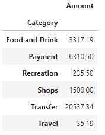

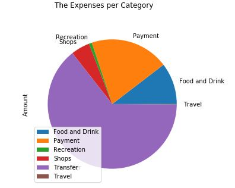

## Bar chart - The number of Transactions were made per category

The total of 48 transactions were made; the highest number of transactions were on Food and Drink (15 transactions) and the lowest number of transactions were on Recreation and shops (3 transactions each)

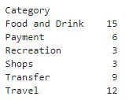

## Expenses per month with Bar graph

The same amount of money was spent in April, May, and June - $10,624.24/month in April, May, and June

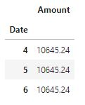

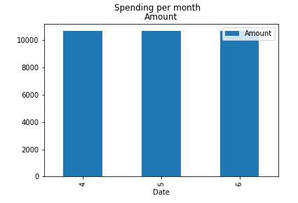

# 2. **Retirement Planning:** 
# Summarize the retirement portfolio analysis and include the charts for the Monte Carlo simulation.
# `60/40` portfolio using `SPY` to represent the stock portion and `AGG` to represent the bonds.

## Monte Carlo Simulation of 500 runs and 30 years for the 60/40 portfolio

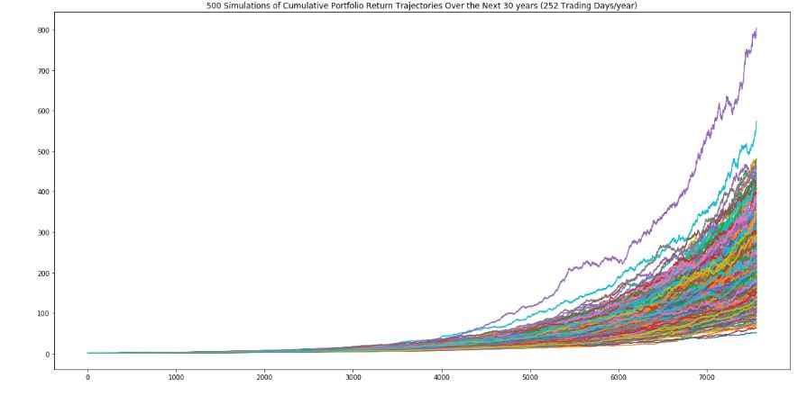

## Monte Carlo Simulation - 90% Confidence Interval

## Retirement Analysis

### 1. What are the expected cumulative returns at `30` years for the `10th`, `50th`, and `90th` percentiles?

Expected cumulative returns at 30 years:

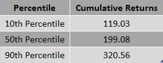

### 2. Given an initial investment of `$20,000`, what is the expected return in dollars at the `10th`, `50th`, and `90th` percentiles?

Expected return at 10th, 50th and 90th percentiles with $20,000 initial investment:

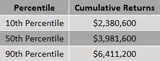

### 3. Given the current projected annual income from the Plaid analysis, will a `4%` withdrawal rate meet or exceed that value at the `10th` percentile? Note: This is basically determining if retirement income is equivalent to current income.

- Projected yearly income : $7,389

- 4% withdrawal for the ending return as retirement income : $95,224

- The retirement income "exceeds" the current projected income

### 4. How would a `50%` increase in the initial investment amount affect the `4%` retirement withdrawal? In other words, what happens if the initial investment had been bigger?

- 4% withdraw rate from the retirement portfolio with 50% increase in the initial investment : $142,836

### How would a 50% increase in the initial investment amount affect the 4% retirement withdrawal? In other words, what happens if the initial investment had been bigger?

- 50% increase in the initial investment amount affects the 4% retirement withdrawal by $47,612

# Optional Challenge #1
## Use the Monte Carlo data and calculate the cumulative returns at the `5%`, `50%`, and `95%` quartiles and plot this data as a line chart to see how the cumulative returns change over the life of the investment.
### This plot shows the expected cumulative returns for any given day between the first day and the last day of investment. 

# Optional Challenge #2
## Early Retirement - How to retire in 5 years instead of 30 years?
## 90/10 portfolio using SPY and AGG and initial investment of $80,000 to retire in 5 years instead of 30 years

## Monte Carlo Simulation of 500 runs and 30 years for the 90/10 portfolio

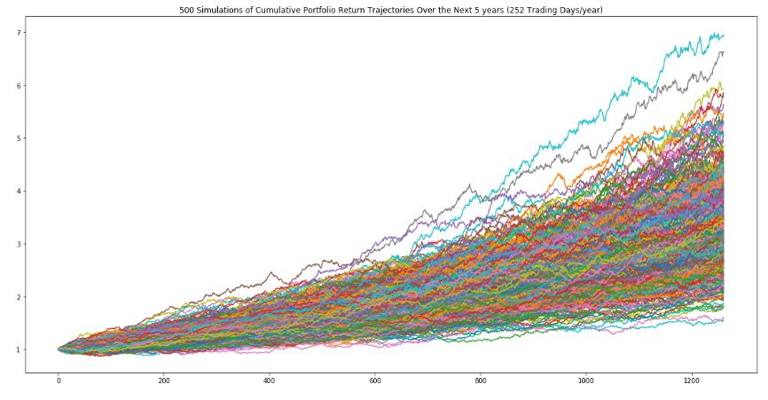

## Monte Carlo Simulation - 90% Confidence Interval

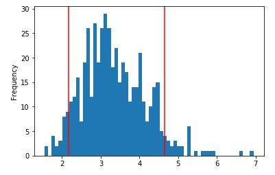

## Retirement Analysis - How to retire in 5 years instead of 30 years?

### 1. What are the expected cumulative returns at `5` years for the `10th`, `50th`, and `90th` percentiles?

Expected cumulative returns at 5 years:

### 2. Given an initial investment of `$80,000`, what is the expected return in dollars at the `10th`, `50th`, and `90th` percentiles?

Expected return at 10th, 50th and 90th percentiles with $80,000 initial investment:

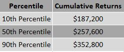

### 3. Given the current projected annual income from the Plaid analysis, will a `4%` withdrawal rate meet or exceed that value at the `10th` percentile? Note: This is basically determining if retirement income is equivalent to current income.

- Projected yearly income : $7,389

- 4% withdrawal for the ending return as retirement income : $7,488

- The retirement income "exceeds" the current projected income

### 4. How would a `50%` increase in the initial investment amount affect the `4%` retirement withdrawal? In other words, what happens if the initial investment had been bigger?

- 4% withdraw rate from the retirement portfolio with 50% increase in the initial investment : $11,232

### How would a 50% increase in the initial investment amount affect the 4% retirement withdrawal? In other words, what happens if the initial investment had been bigger?

- 50% increase in the initial investment amount affects the 4% retirement withdrawal by $3,744

## In order to retire in 5 years instead of 30 years, 90/10 portfolio using SPY and AGG with an initial investment of $80,000 is required

### Submission

* Create Jupyter Notebooks for the analysis and planner and host the notebooks on GitHub.

* Include a Markdown Financial Planner report that summarizes your assumptions and findings and include this report in your GitHub repo.

* Submit the link to your GitHub project to Bootcampspot.

---

© 2020 Trilogy Education Services, a 2U, Inc. brand. All Rights Reserved.
